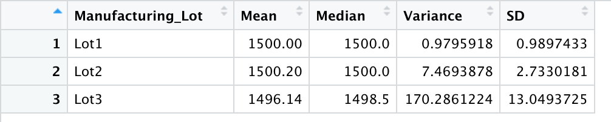
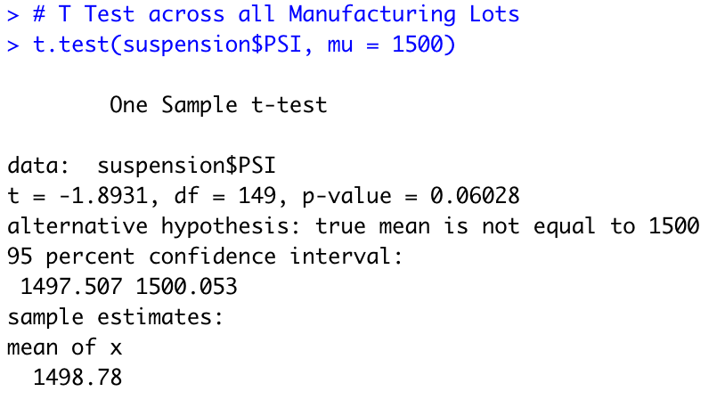
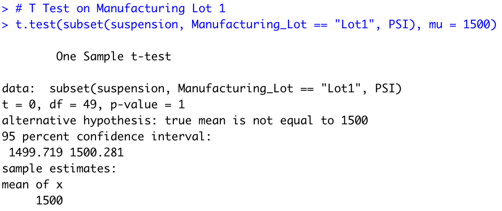
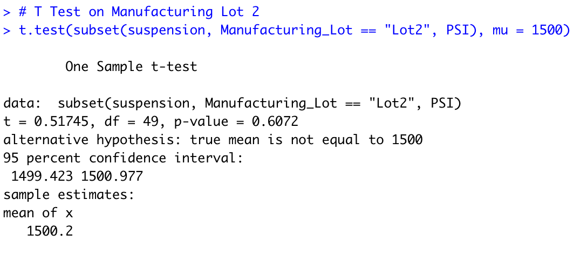
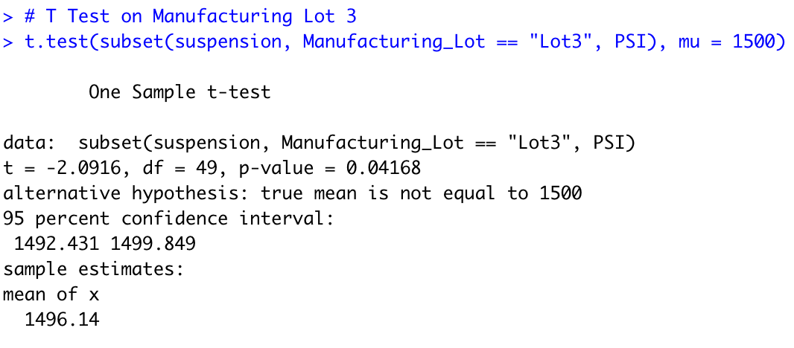

# Challenge-15

## Linear Regression to Predict MPG

Vehicle length and ground clearance provided a non-random amount of variance to the mpg values in the dataset due to their low p values.

Of the 4 predictor variables,vehicle length and ground clearance are the only ones that have estimated slope coefficients that are statistcially different from zero at a 5% significance level. Their very small p values indicate that there is an extremley low chance that sampling error is resposible for causing us to observe data wherein there is a linear relationship between the predictor and the explanatory variables (Beta is not equal to zero) given the intial asssumption that there isn't (Beta is equal to zero).

The linear model does not effectively predict the mpg of MechaCar prototypes. Firstly, 3 out of the 5 predictor variables in this model are not even statistically significant at a 5% level of significance. Secondly, the R squared is only 0.7149. This indicates that about only 71.49% of the variation in mpg of MechaCar prototyopes among the 50 observations is explained by the variation in the vehicle_length, vehicle weight, spoiler angle, ground clearance, and AWD variables. Finally, if we look at the adjusted r squared value of 0.6825, we know that the explanatory power of our model is even lower after correcting for the addition of irrelevant predictor variables in our model. 

## Summary Statistics on Suspension Coils

The mean and median of the pounds per square inch (psi) of the suspension coil of the 150 vehicles across all three manufacturing lots is 1498.78 psi and 1500 psi respectively with a variance of 62.29356. 

After grouping the data by the manufacturing lot, only the variance  of the suspension coil psi for cars in Lot 3 was observed to exceed 100 pounds per square inch.

Based on these tables, the current manufacturing data meets the design specification for all manufacturing lots in total but not for each lot individually. 

This could be because Lot 1 and Lot 2 have very consistent and streamlined manufacturing processes which is reflected by the small variance in suspension coil psi. Meanwhile, the manufacturing process in lot 3 could still be improved since there is a huge variation in the suspension coil psi of the cars produced there. It is also possible that more data needs to be collected from lot 3.

## T-Tests on Suspension Coils

With a p value of 0.06028, we fail to reject the null hypothesis that the overall population mean of suspension coils across all manufacturing lots is equal to 1500 pounds per square inch at a 5% level of significance. At this significance level, we cannot rule out this possibility since we have have insufficient evidence to support the claim that the overall population mean of suspension coils across all manufacturing lots is NOT equal to 1500 pounds per square inch. 

With a p value of 1, we fail to reject the null hypothesis that the  population mean of suspension coils for cars from Manufacturing Lot 1 is equal to 1500 pounds per square inch at a 5% level of significance. At this significance level, we cannot rule out this possibility since we have have insufficient evidence to support the claim that the  population mean of suspension coils for cars from Manufacturing Lot 1 is NOT equal to 1500 pounds per square inch. 

With a p value of 0.6072, we fail to reject the null hypothesis that the  population mean of suspension coils for cars from Manufacturing Lot 2 is equal to 1500 pounds per square inch at a 5% level of significance. At this significance level, we cannot rule out this possibility since we have have insufficient evidence to support the claim that the  population mean of suspension coils for cars from Manufacturing Lot 2 is NOT equal to 1500 pounds per square inch. 

With a p value of 0.04168, we reject the null hypothesis that the  population mean of suspension coils for cars from Manufacturing Lot 3 is equal to 1500 pounds per square inch at a 5% level of significance. At this significance level, we can rule out this possibility since we have have suffiecient evidence to support the claim that the population mean of suspension coils for cars from Manufacturing Lot 3 is NOT equal to 1500 pounds per square inch.

## Study Design: MechaCar vs Competition