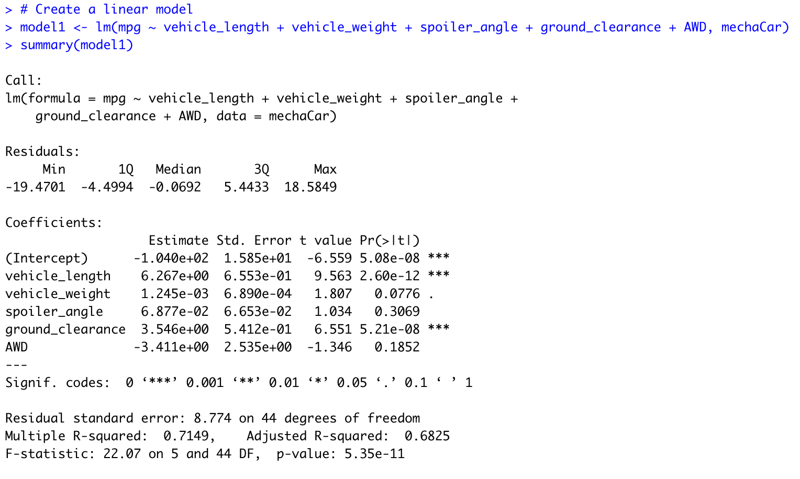

# Challenge-15

## Linear Regression to Predict MPG

Vehicle length and ground clearance provided a non-random amount of variance to the mpg values in the dataset due to their low p values.

Of the 4 predictor variables,vehicle length and ground clearance are the only ones that have estimated slope coefficients that are statistcially different from zero at a 5% significance level. Their very small p values indicate that there is an extremley low chance that sampling error is resposible for causing us to observe data wherein there is a linear relationship between the predictor and the explanatory variables (Beta is not equal to zero) given the intial asssumption that there isn't (Beta is equal to zero).

The linear model does not effectively predict the mpg of MechaCar prototypes. Firstly, 3 out of the 5 predictor variables in this model are not even statistically significant at a 5% level of significance. Secondly, the R squared is only 0.7149. This indicates that about only 71.49% of the variation in mpg of MechaCar prototyopes among the 50 observations is explained by the variation in the vehicle_length, vehicle weight, spoiler angle, ground clearance, and AWD variables. Finally, if we look at the adjusted r squared value of 0.6825, we know that the explanatory power of our model is even lower after correcting for the addition of irrelevant predictor variables in our model. 

